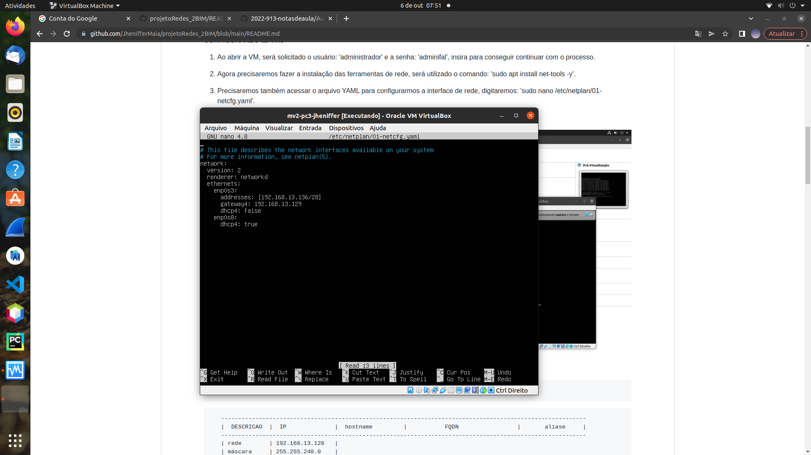

TUTORIAL PARA A CRIAÇÃO DE VMs

1. Primeiro abriremos o terminal e baixaremos o VirtualBox extension: abriremos a pasta desejada usando 'su <nome da pasta>', e após isso 'sudo apt install virtualbox-ext-pack'

2. Antes de abirir a VirtualBox precisaremos criar uma pasta para armazenar nossas VMs.

3.1 Ao entrar você irá encontrar uma aba acima, onde você apertará em arquivo, após abrir as opções você vai em importar Appliance e procurará onde foi alocado o Unbutu, e onde você deseja criar a VM, assim como configurar a quantidade de memoria que usará e o nome dela (Na tabela 1.0 abaixo você encontrará o nome para as VMs.


3.2 Ao criar, agora é só abrir para que possamos configura-lá.

  CONFIGURANDO as VMs
  
  1. Ao abrir a VM, será solicitado o usuário: 'administrador' e a senha: 'adminifal', insira para conseguir continuar com o processo.

  2. Agora precisaremos fazer a instalação das ferramentas de rede, será utilizado o comando: 'sudo apt install net-tools -y'.

  3. Precisaremos também acessar o arquivo YAML para configurarmos a interface de rede, digitaremos: 'sudo nano /etc/netplan/01-netcfg.yaml'.

  3.1 Configure dessa forma:
  
   

        Tabela 1: Definições de endereços IPs da Rede e Nomes de Hosts

```
   ----------------------------------------------------------------------------------------------------------
   |  DESCRICAO  |  IP              |  hostname         |           FQDN                 |       aliase     |
   ----------------------------------------------------------------------------------------------------------
   | rede        | 192.168.13.128   |
   | máscara     | 255.255.240.0    |
   | gateway     | 192.168.13.129   |
   | VM1-PC1     | 192.168.13.130   |   srv-vm1-pc1     | vm1-pc1.grupo9-913.ifalara.net |     maiavm1      |
   | VM2-PC1     | 192.168.13.131   |   srv-vm2-pc1     | vm2-pc1.grupo9-913.ifalara.net |     maiavm2      |
   | VM1-PC2     | 192.168.13.132   |   srv-vm1-pc2     | vm1-pc2.grupo9-913.ifalara.net |     maiavm3      |
   | VM2-PC2     | 192.168.13.133   |   srv-vm2-pc2     | vm2-pc2.grupo9-913.ifalara.net |     joaovm4      |
   | VM1-PC3     | 192.168.13.134   |   srv-vm1-pc3     | vm1-pc3.grupo9-913.ifalara.net |     joaovm5      |
   | VM2-PC3     | 192.168.13.135   |   srv-vm2-pc3     | vm2-pc3.grupo9-913.ifalara.net |     camivm6      |
   | VM1-PC4     | 192.168.13.136   |   srv-vm1-pc4     | vm1-pc4.grupo9-913.ifalara.net |     camivm7      |
   | VM2-PC4     | 192.168.13.137   |   srv-vm2-pc4     | vm2-pc4.grupo9-913.ifalara.net |     maiavm8      |
   ------------------------------------------------------------------------------------------------------
```

  
    !A cada VM e Pc nós colocaremos um ip diferente, lembre de seguir a tabela para não dar erro!
    
   3.2 Dê ctrl + x e salve o arquivo, aplique a nova configuração usando: 'sudo netplan apply', e verifique com: 'ifconfig -a'
   
   4. Agora nomearemos nossos servidores de acordo com os hostnames da tabela.

   4.1 'Digite: sudo hostnamectl set-hostname <hostname>', de acordo com as VMs e os PCs coloque o respectivo hostname.
   4.2 Segue abaixo a tabela de usuários do grupo:
  
```
   ----------------------------------
   |   USUÁRIO   |      SENHA       |
   ----------------------------------
   |   maia      |      maia123     |
   |   maia2     |      maia123     |
   |   joao      |      joao123     |
   |   camila    |     carimila15   |
   ----------------------------------
```

   INSTALAÇÃO DOS SOFTWARES
   
   1. Agora precisaremos de softwares para fazermos nossas conexões, primeiro é preciso mudar o dhcp4 para true, comentar as linhas de endereço ip(Só colocar um # na linha) e mudar o Adaptador1 para NAT.

   2. Feito isso, iremos instalar o servidor SSH.
  
   2.1 Primeiro atualize as definições e versões de pacotes/bibliotecas dos repositórios do ubuntu através do comando 'sudo apt update'.
  
   2.2 Agora atualize os pacotes com as novas definições e versões com o comando: 'sudo apt upgrade -y'.
  
   
  
   
   Esses processos podem demorar um pouco, então seja paciente ;p
  
   2.3 Agora instale o SSH server, digite: 'sudo apt-get install openssh-server'.
  
   2.4 Após instalar verifique se está funcionando através do comando: 'systemctl status ssh'.
  
   
  
   3. Após a intalação do SSH server estiver concluida, iremos configurar o firewall para que conexões via protocolo SSH na porta 22 sejam permitidas.
  
   3.1 Digite o comando: 'sudo ufw allow ssh', para ativar o ssh no firewall UFW do ubuntu.
  
   3.2 Agora ative o firewall através de 'sudo ufw enable'.
  
   3.3 Verifique o status das portas do sistema usando: 'netstat -an | grep LISTEN', as conexões TCP na porta 22 devem estar como LISTENING
  
   
   
   CONECTANDO AS VMs
  
   1. Primeiro de tudo, iremos nas configurações da VM(Precisa estar desligada) e em 'Rede' mudaremos o adaptador para placa em modo bridge colocando o 'Nome' em eno1 e atualizaremos o endereço MAC.
  
  
  
  2. Após fazer esse processo, abra a VM e mude as configurações de rede no YAML usando o codigo: 'sudo nano /etc/netplan/01-netcfg.yaml' e mudaremos o dchp4 para false. Lembre-se de dar o 'sudo netplan apply'.
  
  

  3. Após ter feito esse mesmo processo em todas as VMs, conecte os PCs ao switch.
  
  4. Escolha um principal e teste a conectividade através de 'ping <endereço ip/hostname/fqdn/alias de cada VM criada(uma por vez)>'.


